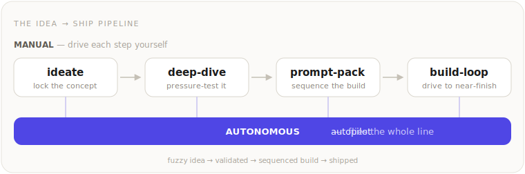

# idea-to-ship

**Composable Agent Skills — for Claude and OpenAI Codex — that take an idea from *fuzzy* → *validated* → *sequenced build* → *shipped*: by hand, or on autopilot.**

Most "build with AI" workflows skip the hard half. They jump straight to code — and skip *deciding what's actually worth building*, *validating it honestly*, and *planning the build so it ships in safe, verifiable steps*. `idea-to-ship` is that missing front half — plus the autonomous build loop on the far side of it: a small, sharp suite of Agent Skills (they run in **Claude** and **OpenAI Codex**), reverse-engineered from real idea→ship journeys (including the mistakes those journeys made), so you don't repeat them.

<p align="center">
  
</p>

<!-- DEMO: the single highest-impact visual is a real one. Drop a short demo gif / asciinema of a skill running (e.g. ideate producing a CONCEPT_BRIEF), or a screenshot of real output, here — for example:
<p align="center"></p>
-->

They're **separate, composable** skills on purpose — sharp triggers, lean context, independent use. Run them **by hand** (the manual tier), or let **`autopilot`** fly the whole line for you (the autonomous tier).

**Who it's for.** Solo and small-team builders who tend to start coding before deciding *what's actually worth building* — working in **Claude** or **OpenAI Codex**. If you've shipped a feature nobody used, rebuilt something and lost the parts that worked, or watched a big change stall halfway, this suite front-loads the discipline that prevents it. Each skill also earns its keep alone. (`deep-dive` is token-hungry by design — see its note below; it shines most when you're not token-constrained, e.g. on a Claude Max plan.)

## The pipeline

1. **`ideate`** — turn a fuzzy idea (or an existing thing you want to improve) into a *locked* concept + roadmap, captured in one living `CONCEPT_BRIEF.md`. A blunt, honest co-founder: it forces a success metric and a kill criterion, refuses to spec before the concept survives an honest pressure-test, and hands off cleanly to `prompt-pack`.
2. **`deep-dive`** — the rigor engine `ideate` leans on for high-stakes validation (and that you can run directly on any codebase, strategy, design, or research question): parallel specialist agents → synthesis → adversarial red-team → a plain-English verdict with honest 1–10 confidence.
3. **`prompt-pack`** — turn a settled concept into a sequence of self-contained, independently-shippable build prompts: each does one unit, verifies itself, and leaves the app working before the next. Run them in one chat or spread across many — each prompt is self-contained, so any unit moves cleanly to a fresh chat whenever you want (or need) one. Also writes paste-ready handoffs to resume a chat or relay work to another tool.
4. **`build-loop`** — drive a build past *"it compiles"* to **near-finish-line craft**: it *sees and exercises* the running app — render → screenshot → critique → rebuild, multi-pass — and checks the machine facts (build, tests, flows, console, a11y) until acceptance criteria pass or a stop-condition fires (no infinite thrash). When feel is load-bearing the visual design loop runs every iteration. Honest bound: objective craft + a self-graded taste pass, ~80% of the way — not a finished or validated product.

→ **drive each step yourself**, or let **`autopilot`** fly the whole line autonomously — in character as a grounded founder-persona — handing back a near-finish-line *first draft* plus an honest ledger of what only a human or the market can finish.

## Quickstart — try one first

| If you want to… | Type this | You get back |
|---|---|---|
| Decide *what* to build | "I have an idea for *X* — help me decide if it's worth building." | `docs/CONCEPT_BRIEF.md` |
| Investigate something rigorously | "Do a standard design evaluation of *X*. Research-only." | `research/<topic>/` + an executive briefing |
| Turn settled scope into a build plan | "Make a prompt pack from `docs/CONCEPT_BRIEF.md`." (or "*X* is too big for one chat — make me a prompt pack.") | `docs/<TOPIC>_PROMPT_PACK.md` |
| Drive a build to near-finish-line craft | "Loop on this until the core flows pass and the UI holds its design bar." | a self-verified, iterated build + an honest craft ledger |
| Fly the whole pipeline autonomously | "Run autopilot on *X*." | a `CONCEPT_BRIEF`, a build pack, a first-draft app + an honest hand-off |

Each works standalone; run them in sequence — or on autopilot — for the full idea→ship pipeline.

<details>
<summary><strong>See what you actually get back — a worked example</strong> (click to expand)</summary>

**`ideate` → `docs/CONCEPT_BRIEF.md`** *(excerpt — the locked concept + honest verdict, edited in place across the session, not regenerated):*

> - **Confidence verdict:** 7/10 — would move to 8 if 5 target users confirm the triage pain in interviews; down to 4 if they already tolerate shared Gmail.
> - **One-line promise:** Every client message handled by the right person, fast — without anyone owning a chaotic shared inbox.
> - **Beachhead persona:** 2–6 person creative/client-service studios. *(Secondary: solo freelancers — not v1.)*
> - **Success metric:** % of client messages with a clear owner + reply within 1 business day.
> - **Kill criterion:** If 5 target studios won't try a 2-week pilot, shelve it.
> - **Scope OUT / deferred:** Outlook, analytics dashboard, mobile app — each named with a one-line reason.
> - LOCKED: Layer on existing email, don't replace it — lowers switching cost (the wedge).

**`deep-dive` → `research/<topic>/NN-executive-briefing.md`** *(excerpt — verdict-first, after parallel specialists + an adversarial red-team):*

> **TL;DR.** Sound core; one blocker before you ship. **Confidence: 6/10 — 4 of 7 load-bearing findings externally verified (tests + `git`); the rest rest on model judgment.**
> - **[Blocker]** Currency rounding diverges between server and client — `pricing.ts:142` vs `format.ts:88`.
> - **[High]** No regression test covers the refund path; a silent change there ships unnoticed.
> - **Should you proceed?** Fix the blocker, add the refund test, then ship Phase 1.

**`prompt-pack` → `docs/<TOPIC>_PROMPT_PACK.md`** *(excerpt — one self-contained, independently-shippable unit; reads the brief above):*

> **P2 · Add per-currency rounding — Risk: HIGH**
> **Read first:** `CLAUDE.md`, `docs/CONCEPT_BRIEF.md`, `pricing.ts` — *verify file:line before editing.*
> **What MUST NOT change:** the public `formatAmount()` signature; existing USD output.
> **Verification:** `npm test pricing` + manual matrix (regression: USD unchanged · new: JPY 0-decimal, BHD 3-decimal).
> **When done:** report files changed + test results. **Do not commit — wait for explicit go.**

</details>

## The skills

**Manual tier — drive each step yourself.**

### 🧭 ideate — *find & validate what to build*
Fuzzy idea → locked concept + roadmap. Two modes: **greenfield** (a new idea) and **refinement** (evaluate/improve an existing thing). Triggers: *"help me figure out what to build"*, *"is this idea any good"*, *"should I rebuild X"*, *"turn my idea into a plan"*. → [ideate-skill](https://github.com/nelsonwerd/ideate-skill)

### 🔬 deep-dive — *investigate it rigorously*
Multi-agent investigative analysis for questions that deserve more than a one-shot answer: audits, strategy/viability evaluations, design reviews, open research. Triggers: *"do a deep dive"*, *"thorough audit"*, *"evaluate this strategy"*, *"is this sound/safe"*. → [deep-dive-skill](https://github.com/nelsonwerd/deep-dive-skill)

> **Note — `deep-dive` is token-hungry by design.** A full run fans out 4–6 specialist agents (each writing thousands of words), then synthesis, follow-up verification, a red-team pass, and a briefing — easily 10+ agent calls and tens of thousands of tokens for one analysis. That's the right trade for a high-stakes call, and a great fit on a **Claude Max** plan (or any setup where you're not token-constrained). On a smaller plan, reach for it deliberately: lean on its built-in *Scale heuristics* (2–3 lanes for narrow scope, skip the red-team for low-stakes work), or ask for a single-pass review instead. `ideate` and `prompt-pack` are far lighter.

### 📦 prompt-pack — *turn it into a shippable plan*
A big job → ordered, self-contained prompts, each shippable on its own, plus handoffs. Run them in one chat or across many. Triggers: *"make a prompt pack"*, *"break this into phases"*, *"I'm running out of context"*, *"write me a handoff"*. → [prompt-pack-skill](https://github.com/nelsonwerd/prompt-pack-skill)

**Autonomous tier — the pipeline drives itself.**

> **Experimental — and honest about why.** The autonomous tier is an early, lightly-proven experiment: genuinely capable and a lot of fun to watch, but not battle-tested — treat it as a promising prototype, not a production tool. It produces a near-finish-line-*aimed* **first draft a human finishes** — not a finished or market-validated product. Three limits it doesn't escape: a **~80% craft ceiling** with a last-mile correctness/security/taste tail; the **grounding firewall** (real data may discover the problem and seed the build, but a synthetic persona's reaction never counts as validation); and judgment quality isn't cleanly measurable — its go/kill calls are a **signal a human weighs**, never proof. Market validation stays the human handoff.
>
> **And it's token-heavy.** A single `autopilot` run drives the whole pipeline — a `deep-dive`, a multi-pass visual loop, a different-model critic — so it can span hours and a lot of tokens. Best on a **bigger plan (e.g. Claude Max)** or any setup where you're not token-constrained; on a smaller plan, reach for the manual-tier skills directly, or scope the run tight.

### 🚀 autopilot — *fly the whole pipeline autonomously*
Runs **ideate → deep-dive → prompt-pack → build-loop** end-to-end, in character as a *grounded* founder-persona — **composing** the manual-tier skills, never reimplementing them. Hands back a `CONCEPT_BRIEF`, a validated build pack, a first-draft product, and an honest ledger of what only a human/market can finish. Carries **execute-discipline** (build only the gated scope; emit a human-only gate, never fake it). Triggers: *"run autopilot"*, *"build this idea→ship autonomously"*, *"fly the whole pipeline end to end"*. *Suite-only — no standalone repo.*

### 🔁 build-loop — *drive a build to near-finish-line craft*
Loops **build → see → exercise → check → critique → rebuild** over the agent's existing tools (headless screenshot + vision to *see*, Playwright to *exercise*, axe/Lighthouse to *check*) until acceptance criteria pass or a stop-condition fires — no infinite thrash. When feel is load-bearing it runs a **mandatory, multi-pass visual design loop** (render → critique → fix → re-render, every iteration) with a different-model critic as the taste check. Honest bound: it flags *ugly/broken/missing* reliably but stays self-graded on *genuinely good* → a **human spot-check is the final taste gate**; market validation is out of scope. Triggers: *"tighten this build"*, *"iterate until it passes"*, *"self-verify the UI"*. *Suite-only — no standalone repo.*

*An optional `ground` module — real data to seed the persona and the build — is planned; the autonomous tier runs fully without it, and the firewall holds either way.*

## How they compose

- `ideate` produces a **`CONCEPT_BRIEF.md`** — the single artifact `prompt-pack` consumes to author build prompts. (ideate delivers the *what & why*; prompt-pack derives the *how* from your actual code.)
- `ideate` **delegates to `deep-dive`** when a concept needs heavy, current-sourced validation, and folds the verdict back into the brief.
- `build-loop` drives any build — from a `prompt-pack` step or on its own — toward near-finish-line craft; it's the craft engine the autonomous tier leans on.
- `autopilot` **composes all four** (ideate → deep-dive → prompt-pack → build-loop) to fly the whole pipeline autonomously — orchestration only, never reimplementing them.
- Each is also fully useful **on its own** — run `deep-dive` to audit a codebase, `prompt-pack` to sequence a refactor, `ideate` to gut-check an idea, `build-loop` to tighten a build — without the others.

**Which skill for which question?** (they overlap on "evaluate / plan" — here's the precedence)

| The user is really asking… | Skill | Then |
|---|---|---|
| *What should I build? Is this idea worth pursuing?* | **ideate** | locks a `CONCEPT_BRIEF.md`; delegates heavy validation to `deep-dive` mid-funnel |
| *Is this correct / safe / viable / evidence-backed?* | **deep-dive** | returns a verdict + confidence; if it was validating a concept, hands a block back to `ideate` |
| *Scope is settled — sequence the build* | **prompt-pack** | reads `CONCEPT_BRIEF.md` if present; offers `ideate` first if the idea is unsettled |
| *Does this build actually work + hold a craft bar?* | **build-loop** | loops see/exercise/critique until it passes or a stop-condition fires |
| *Build the whole thing for me, autonomously* | **autopilot** | flies ideate→…→build-loop in-character; hands back a first draft + an honest ledger |
| *Genuinely unclear* | ask one question | *viability direction, rigorous audit, execution-planning, or autonomous build?* |

These compose, but each also runs alone — install only the one you need.

## Install

These follow the open **[Agent Skills](https://agentskills.io) standard**, so they run in **Claude** and **OpenAI Codex** — install them all as a **Claude Code plugin**, drop them into your **Codex skills folder**, or copy individual skills anywhere. Pick your setup:

| You use… | Get them all by… |
|---|---|
| **Claude Code** — terminal, the **Code** tab of the Claude desktop app, [claude.ai/code](https://claude.ai/code), or a VS Code / JetBrains IDE | the **plugin** (Option 1), or a manual copy (Option 2) |
| **OpenAI Codex** — CLI, app, or IDE | copying the skills into `~/.agents/skills/` (Option 2) |
| **Claude chat** — the **Chat** tab of the desktop app, or [claude.ai](https://claude.ai) (non-coding use) | uploading each skill's **`.skill`** zip (in this repo root) under **Customize → Skills**. Best for `ideate`; the others want repo/file access (and `build-loop`/`autopilot` want the build tools too). |
| **Any other agent** | pointing it at any `skills/<name>/SKILL.md` — it's just instructions |

<sub>**"Claude Code" and "Claude chat" both live in the one Claude desktop app** — its **Code** tab vs its **Chat** tab (plus their terminal / web / IDE surfaces). Plugins install in Claude Code only; the Chat tab takes uploaded skills under *Customize → Skills*.</sub>

### Compatibility by skill × surface

The skill *format* is portable; some *runtime* features (parallel subagents, progress tools, web/repo access, a headless browser) are richest in Claude Code and Codex. Each skill still runs everywhere — degraded cells lose mechanics, not method.

| Skill | Claude chat | Claude Code | OpenAI Codex | Other agents |
|---|---|---|---|---|
| **ideate** | Strong — concept work; brief kept inline when there's no file tree | **Best** | Strong — with a local workspace for the brief | Works — full method; keep the brief in a file or inline |
| **deep-dive** | Works (degraded: no repo/file access; lanes run serially) | **Best** — parallel subagents + web | Strong — same lanes run **serially** (lower cross-agent independence, so confidence is capped); external claims labeled *unverified* if no web | Works (degraded: serial lanes, local-only; label external claims *unverified*) |
| **prompt-pack** | Limited — best for high-level planning/handoffs; weak without repo access | **Best** | **Best** — reads `AGENTS.md`, full repo access | Works — with repo/file access |
| **build-loop** | Limited — no headless browser/Playwright; degrades to build/test/static checks (say so) | **Best** — interactive renderers + Playwright + a different-model critic | **Strong** — Playwright screenshot loop; the critic needs a separate model available | Works — wherever `bash` + a headless browser run |
| **autopilot** | Not recommended — needs the full pipeline's tools | **Best** | **Strong** — composes the tier; **proven end-to-end** (critic needs a separate model) | Works — with repo + tool access |

<sub>Menu names/commands drift between versions — the linked docs are the source of truth. Claude-specific bits (the plugin manifest format; deep-dive's parallel-subagent orchestration) don't all carry to Codex; the **methodology is fully portable** — `deep-dive` ships an *Environment & fallbacks* section that runs the same lanes serially when subagents aren't available, and `build-loop` falls back to a Playwright screenshot loop where interactive renderers aren't.</sub>

> **On the autonomous tier specifically:** its design loop leans on a *different-model critic* + parallel orchestration that are richest in **Claude Code** — where it can spawn a genuinely different model to grade taste. In our runs, the *design* output was noticeably stronger on Claude; on Codex the pipeline still runs end-to-end (proven), but without a separate model for the taste critic it degrades, so expect weaker polish. **Reach for Claude when feel is the wedge** — and either way, a human spot-check stays the final taste gate.

### Option 1 — Claude Code plugin (all skills, namespaced)
```bash
/plugin marketplace add nelsonwerd/idea-to-ship-skills
/plugin install idea-to-ship@nelsonwerd
```
Or, in the desktop app's **Code** tab: click **+** next to the prompt → **Plugins** → add this marketplace and install. The skills become `/idea-to-ship:ideate`, `/idea-to-ship:deep-dive`, `/idea-to-ship:prompt-pack`, `/idea-to-ship:autopilot`, `/idea-to-ship:build-loop` and auto-activate on matching requests (run `/reload-plugins` if they don't appear).

> **Already have the skills installed manually?** They still work. To avoid duplicate names, remove the old copies first: `rm -rf ~/.claude/skills/{ideate,deep-dive,prompt-pack,autopilot,build-loop}`. (The plugin namespaces its skills, so it won't collide.)

### Option 2 — copy the skills (any tool, always works — and the Codex path)
```bash
git clone https://github.com/nelsonwerd/idea-to-ship-skills.git
cp -r idea-to-ship-skills/skills/* ~/.claude/skills/     # Claude Code
cp -r idea-to-ship-skills/skills/* ~/.agents/skills/     # OpenAI Codex
```
No restart needed in Claude Code (it detects them in-session); **restart Codex** to load skills dropped into `~/.agents/skills/` (Codex also scans a repo-level `.agents/skills/` if you want a skill in one project only). Then use them directly (`/ideate` in Claude; `/skills` or just describe the task in Codex) or let either tool auto-activate by description.

> **Updating:** the Claude plugin uses **commit-SHA versioning**, so every push to this repo counts as an update — no version bump to wait on. In **Claude Code**, run `/plugin update` (or turn on auto-update for the marketplace in `/plugin` → **Marketplaces**, and it refreshes at startup). For a **copied** install (Codex via `~/.agents/skills/`, or a manual Claude copy), `git pull` and re-copy.

## Why this exists

Each skill encodes a specific failure mode it prevents — learned the hard way from real builds:
- **ideate** stops you from *speccing before validating* and from *building with no success metric or kill criterion*.
- **deep-dive** stops you from *trusting a confident one-shot answer* on a high-stakes call — it red-teams its own conclusions and cites current sources.
- **prompt-pack** stops a big build from *drifting* or *leaving the app half-broken between steps* — and keeps each unit small enough to outlast a context limit if you hit one.
- **build-loop** stops a build from *looking done while half-wired* — it renders and exercises the real UI instead of trusting that it compiles, and reports a check it couldn't run as *not run*, never green.
- **autopilot** stops an autonomous run from *overbuilding past its validated scope or faking a gate it actually abandoned* — the sharpest failure mode of "agent, go build it."

Small, sharp, composable tools across two tiers — not one monolith. That's the point.

## Standalone homes

This repo bundles the suite. The three **manual-tier** skills also have canonical standalone repos; the **autonomous-tier** skills live in the suite repo + live installs only (no standalone repo yet):

| Skill | Repo |
|---|---|
| ideate | https://github.com/nelsonwerd/ideate-skill |
| deep-dive | https://github.com/nelsonwerd/deep-dive-skill |
| prompt-pack | https://github.com/nelsonwerd/prompt-pack-skill |
| autopilot | *suite-only — no standalone repo* |
| build-loop | *suite-only — no standalone repo* |

## License

MIT © 2026 Drew Nelson
